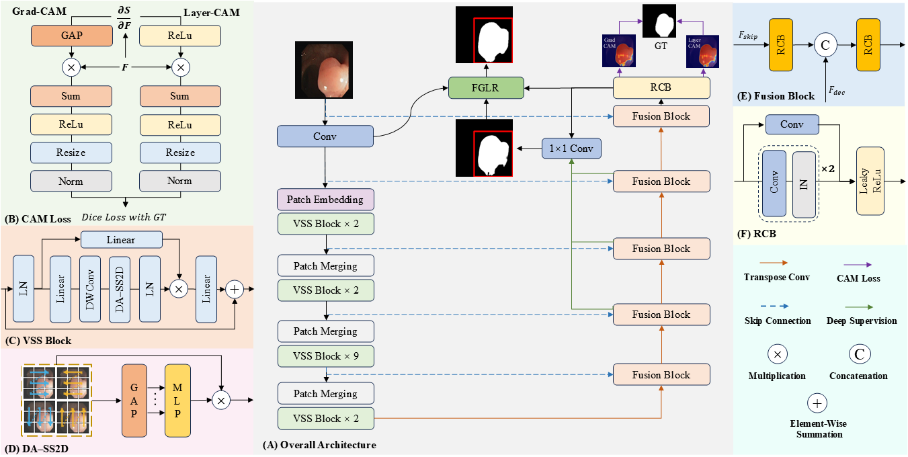

# Interpretable Feature-Reuse Local Refinement Network with Direction-Adaptive Mamba for Medical Image Segmentation

Official implementation of *Interpretable Feature-Reuse Local Refinement Network with Direction-Adaptive Mamba for Medical Image Segmentation*.

<p align="center">
  
</p>

## Overview

This work presents an interpretable two-stage medical image segmentation framework that combines Feature-Guided Local Refinement with Direction-Adaptive Mamba.

Our main contributions are:

- **CAM-Regularized Feature-Reuse Refinement Framework.** We introduce a two-stage segmentation framework that uses coarse predictions for spatial localization and reuses native encoder-decoder features for local refinement without an auxiliary deep network.
- **Feature-Guided Local Refinement (FGLR).** The lightweight ROI-centric module crops encoder and decoder features using prediction-guided coordinates, then refines local segmentation boundaries.
- **CAM-Guided Supervision Loss.** Grad-CAM and Layer-CAM heatmaps are aligned with the ground-truth mask through an auxiliary Dice objective, encouraging target-aware activations in the base network.
- **Direction-Adaptive 2D Selective Scan (DA-SS2D).** A lightweight fusion mechanism adaptively weights the four V-Mamba scan directions to strengthen representations of anisotropic and irregular structures.

## Installation

Create a CUDA-enabled Python environment, then install:

```bash
pip install -r requirements.txt
```

## Model Weights

Download pre-trained weights: [Google Drive](https://drive.google.com/file/d/1GdjbsR1zDe6PUpI-K6sNdk7i3F9BJwXP/view?usp=sharing)

## Quick Start

### 1. Prepare Data

Download a supported dataset and organize it in the layout required by its preset. The preparation command generates `manifest.json` and `splits.json` for training.

**CVC-ClinicDB**

```text
/path/to/CVC-ClinicDB/
├── Original/
│   ├── 1.png
│   ├── 2.png
│   └── ...
└── Ground Truth/
    ├── 1.png
    ├── 2.png
    └── ...
```

```bash
python tools/prepare_dataset.py --preset cvc \
  --dataset-root /path/to/CVC-ClinicDB \
  --output-dir /path/to/CVC-ClinicDB
```

**ISIC2018**

```text
/path/to/ISIC2018/
├── ISIC2018_Input/
│   ├── ISIC_0000000.jpg
│   ├── ISIC_0000001.jpg
│   └── ...
└── ISIC2018_GroundTruth/
    ├── ISIC_0000000_segmentation.png
    ├── ISIC_0000001_segmentation.png
    └── ...
```

```bash
python tools/prepare_dataset.py --preset isic \
  --dataset-root /path/to/ISIC2018 \
  --output-dir /path/to/ISIC2018
```

**BUSI**

The raw BUSI archive contains category folders and may provide more than one mask for an image. Run the BUSI preparation script first; it merges all masks for each image and creates the following layout:

```text
/path/to/BUSI_prepared/
├── images/
│   ├── benign_001.png
│   ├── malignant_001.png
│   └── ...
└── masks/
    ├── benign_001.png
    ├── malignant_001.png
    └── ...
```

```bash
python tools/prepare_busi.py \
  --busi-root /path/to/BUSI \
  --output-dir /path/to/BUSI_prepared

python tools/prepare_dataset.py --preset busi \
  --dataset-root /path/to/BUSI_prepared \
  --output-dir /path/to/BUSI_prepared
```

For a custom binary segmentation dataset, use matching image and mask file names:

```bash
python tools/prepare_dataset.py \
  --image-dir /path/to/images \
  --label-dir /path/to/masks \
  --output-dir /path/to/dataset \
  --dataset-name MyDataset \
  --file-ending .png
```

### 2. Train

Single fold:

```bash
python train.py \
  --config configs/maskpolish_swinumamba.yaml \
  --fold 0 \
  --cfg-options \
    data.manifest_json=/path/to/manifest.json \
    data.splits_json=/path/to/splits.json \
    output.save_dir=/path/to/results
```

Five folds:

```bash
NPROC_PER_NODE=2 bash tools/train_all_folds.sh \
  --config configs/maskpolish_swinumamba.yaml \
  --cfg-options \
    data.manifest_json=/path/to/manifest.json \
    data.splits_json=/path/to/splits.json \
    output.save_dir=/path/to/results
```

Outputs are written as:

```text
<save_dir>/FGLRSwinUMamba_fold0/
  checkpoint_best.pth
  training_log.txt
```

### 3. Evaluate Model

```bash
python inference.py \
  --config configs/maskpolish_swinumamba.yaml \
  --weights-root /path/to/outputs \
  --fold 0 \
  --manifest /path/to/dataset/manifest.json \
  --splits /path/to/dataset/splits.json
```

## Project Structure

```text
MaskPolish-SwinUMamba/
├── configs/
│   └── maskpolish_swinumamba.yaml  # Model, data, and training configuration
├── data/
│   ├── dataset.py                  # Manifest-backed segmentation dataset
│   ├── split.py                    # Manifest and cross-validation split utilities
│   └── transforms.py               # Data augmentation and preprocessing
├── nets/
│   ├── blocks/
│   │   ├── aspp.py                 # Atrous Spatial Pyramid Pooling
│   │   └── fglr.py                 # Feature-Guided Local Refinement
│   ├── build.py                    # Model builder
│   └── SwinUMamba.py               # SwinUMamba with DA-SS2D and FGLR
├── tools/
│   ├── prepare_busi.py             # BUSI mask merging and data organization
│   ├── prepare_dataset.py          # Manifest and split generation
│   └── train_all_folds.sh          # Five-fold training launcher
├── training/
│   ├── cam_loss.py                 # Grad-CAM and Layer-CAM supervision
│   ├── loss.py                     # Segmentation loss functions
│   ├── metrics.py                  # Evaluation metrics
│   └── logger.py                   # Training logging
├── inference.py                    # Five-fold checkpoint evaluation
├── train.py                        # Training entry point
├── requirements.txt                # Python dependencies
└── README.md
```

## Acknowledgments

- The authors of Swin-UMamba for their open-source implementation.
- The CVC-ClinicDB, ISIC 2018 Challenge, and BUSI datasets.
